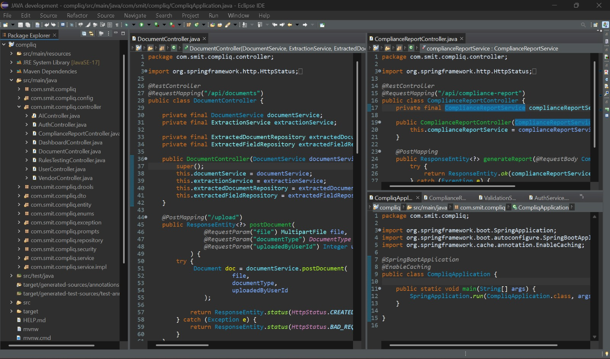
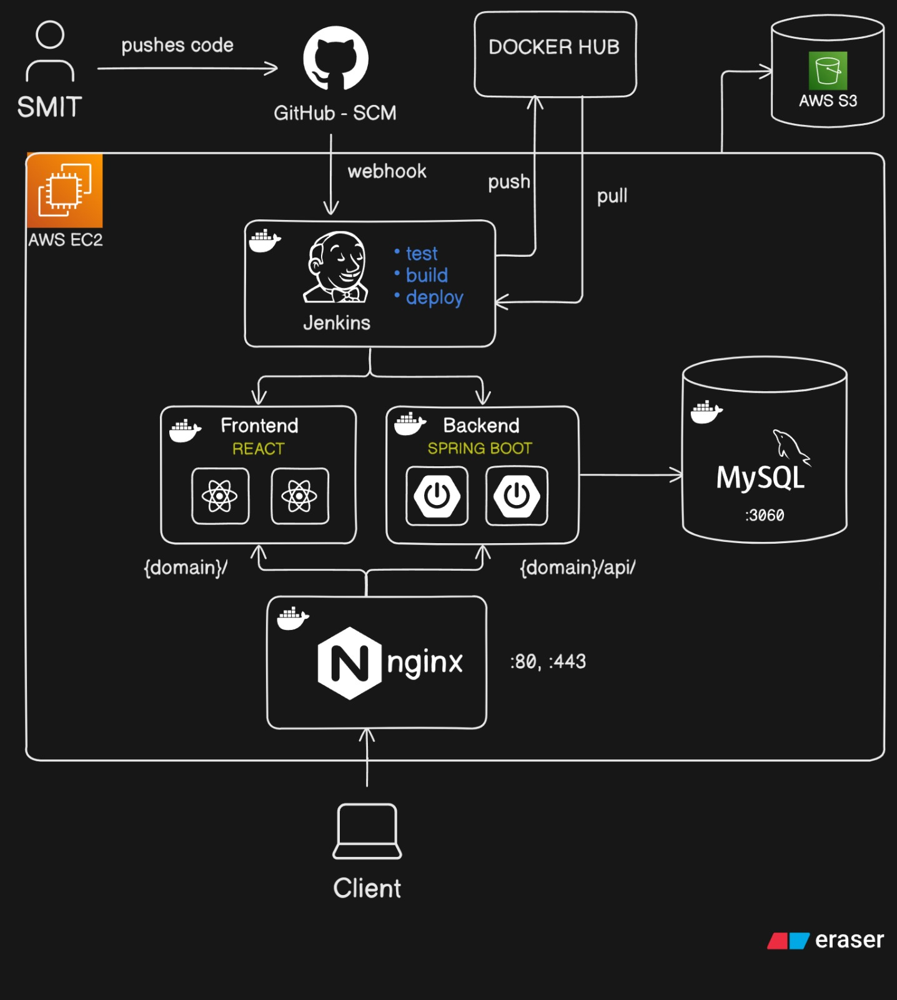
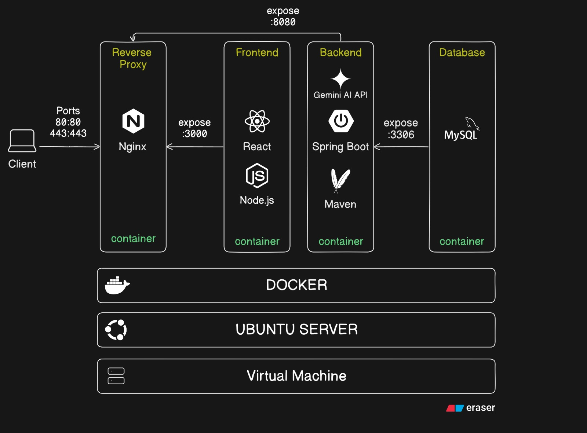

# CompliQ

CompliQ is an AI-powered compliance analysis system designed to help users interact with enterprise documents. It allows users to ask questions in natural language and receive answers strictly grounded in their organization's specific policies, regulations, and compliance documents.

## Table of Contents
- [Problem](#problem)
- [Architecture](#architecture)
- [Tech Stack](#tech-stack)
- [Features](#features)
- [How to Run](#how-to-run)
- [Environment Variables](#environment-variables)
- [API Documentation](#api-documentation)
- [Screenshots](#screenshots)
- [Key Design Decisions](#key-design-decisions)
- [Future Improvements](#future-improvements)

## Problem
In any organization, there is a vast sea of compliance policies, regulations, contracts, and internal guidelines. Manually searching through these lengthy documents to answer a specific compliance question is tedious, time-consuming, and prone to human error. 

CompliQ solves this by allowing users to upload their documents and simply ask questions in natural language. The system instantly retrieves the relevant sections and uses them to formulate an accurate answer, making compliance information easily accessible while ensuring the answers remain grounded in the organization's verified documents.

## Architecture
CompliQ uses a **Retrieval-Augmented Generation (RAG)** pipeline to ensure answers are accurate and context-aware rather than relying on an LLM's general knowledge:

1. **Document Ingestion:** When a document is uploaded, text is extracted and split into smaller, manageable chunks.
2. **Embedding & Storage:** These chunks are converted into vector embeddings and stored in a vector database (**PgVector**) alongside relevant metadata. Document files are stored securely in **AWS S3**.
3. **Query Processing:** User questions are converted into embeddings, and a similarity search is performed against the vector database to find the most relevant document chunks.
4. **Generation:** The retrieved chunks are injected as context into the LLM prompt. The LLM then generates a precise answer based exclusively on that retrieved context.

The application is containerized with **Docker**, uses **Nginx** as a reverse proxy, and is deployed on **AWS EC2**, with **Jenkins** handling CI/CD pipelines.

## Tech Stack
- **Backend:** Java, Spring Boot, Spring Security (JWT)
- **Database & Storage:** PostgreSQL, PgVector, AWS S3
- **AI & Data Flow:** RAG Pipeline, Vector Embeddings, LLM Integration
- **Infrastructure:** Docker, Nginx, AWS EC2, Jenkins

## Features
- **Natural Language Q&A:** Ask complex compliance questions and get immediate, human-readable answers.
- **Document-Grounded Responses:** Employs RAG to eliminate hallucinations; answers are based strictly on uploaded files.
- **Secure Authentication:** Robust user authentication and session management using Spring Security and JWT.
- **Scalable Document Management:** Seamless file uploading and storage powered by AWS S3.

## How to Run

1. Clone the repository:
   ```bash
   git clone https://github.com/your-username/compliq.git
   cd compliq
   ```
2. Ensure you have **Docker** and **Docker Compose** installed on your machine.
3. Configure your `.env` file (see the Environment Variables section).
4. Build and start the services using Docker Compose:
   ```bash
   docker-compose up -d --build
   ```
5. The backend will be accessible at `http://localhost:8080`.

## Environment Variables
Create a `.env` file in the root directory and configure the following variables before running the application:

```env
# Database Configuration
POSTGRES_USER=your_db_user
POSTGRES_PASSWORD=your_db_password
POSTGRES_DB=compliq_db
POSTGRES_URL=jdbc:postgresql://db:5432/compliq_db

# AWS S3 Configuration
AWS_ACCESS_KEY_ID=your_access_key
AWS_SECRET_ACCESS_KEY=your_secret_key
AWS_REGION=your_aws_region
S3_BUCKET_NAME=your_bucket_name

# Security
JWT_SECRET=your_jwt_secret_key
JWT_EXPIRATION=86400000

# AI / LLM Configuration
LLM_API_KEY=your_llm_api_key
```

## API Documentation
*Key endpoints for the CompliQ backend:*

- `POST /api/auth/login` - Authenticate a user and receive a JWT token.
- `POST /api/documents/upload` - Upload a compliance document to S3 and trigger the embedding process.
- `POST /api/query` - Submit a natural language question and receive an LLM-generated answer based on document context.

## Screenshots





## Key Design Decisions
- **RAG over Fine-Tuning:** Opted for a Retrieval-Augmented Generation approach to ensure the LLM strictly references current organizational policies. This also allows the system's knowledge base to be updated instantly by adding or removing documents, without the need for expensive model retraining.
- **PgVector Integration:** Selected PgVector to keep both relational data (users, metadata) and vector embeddings within the same PostgreSQL ecosystem, simplifying infrastructure and maintenance.
- **Stateless Authentication:** Used JWT for authentication to ensure the backend remains stateless and easily horizontally scalable.

## Future Improvements
- **Source Citations:** Enhance the UI to highlight exactly which page and paragraph from the original document the answer was sourced from.
- **Multi-Tenant Architecture:** Securely isolate data and policies for different organizations or departments within a single application instance.
- **Advanced Document Parsing:** Improve text extraction to better handle complex tables, graphs, and images often found in legal and compliance PDFs.
- **Role-Based Access Control (RBAC):** Restrict document queries based on user roles (e.g., ensuring only HR can query HR-specific policies).
